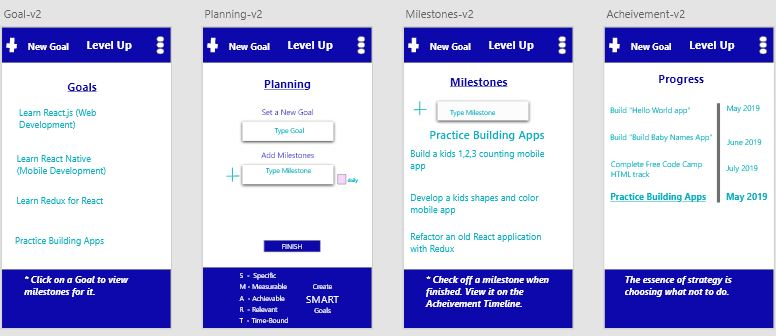

# Level Up Dev

### Table of Contents

1. Demo Link
2. Purpose
3. Motivation
4. Objectives
5. Wireframe
6. Technologies Used

### Click to install Android app from the Google Play Store: [Level Up](https://play.google.com/store/apps/details?id=com.levelup.mobile)

### Purpose:

Help developers guide their learning path by planning goals,  breaking those goals down into milestones, and displaying  a timeline of successes. 

### Motivation:

This project was used to practice developing with React Native and related libraries like React-navigation and Native-base.

### Objectives:

- Allow the user to view all goals.
- Allow the user to create new goals with milestones. 
- Allow the user to view a selected goal’s milestones and when click on a milestone, move it to the Achievement page.
- Allow the user to view all past completed goals and milestones.

### WireFrame

### This app was built with the following technologies:

**React Native:** JavaScript mobile app framework

**Git-Hub:** Web-based version control repository and Internet hosting service

**React-Navigation:**  Navigation library for React’s web and mobile apps

**Native-Base:** Open source UI component library for React Native

**Abode XD** A wire-framing tool used to create a mockup/visual of what is to be coded

**JavaScript:** Object-oriented programming language for web pages

**HTML:** Mark-up language for creating web pages

**CSS:** A formatting language for styling web pages

_Create by JC Smiley in December of 2019_
